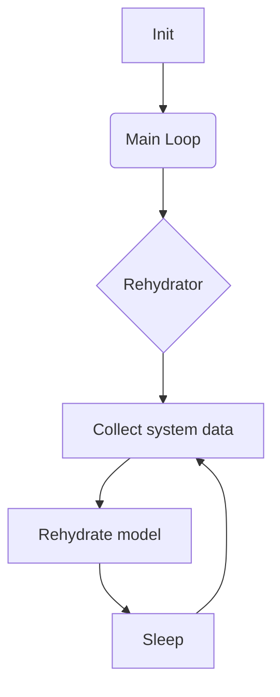
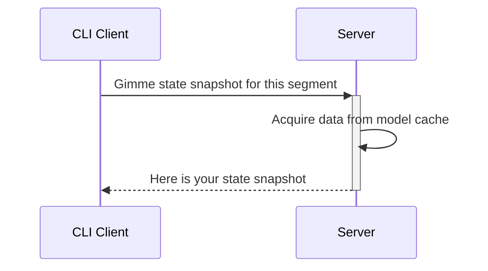

# Rusty Belt


# What is it
Client-server implementation of tmux statuses

# Why
I hate to write shell scripts

# Why it  may be better than other statuses
Server caches all state and client fetches only status snapshot. So client can ask a server 1000 times per sec and it will not affect render time.

# How to install
<details>
  <summary>Install on GNU/Linux with cargo</summary>

```bash
cargo install rusty-belt
cd ~/.config/systemd/user/

touch rusty-belt.service # see example in resources/rusty-belt.service
systemctl daemon-reload --user
systemctl --user restart rusty-belt.service

mkdir ~/.config/rusty-belt
cd ~/.config/rusty-belt

touch config.yaml # see example in examples/config.yaml
touch log4rs.yaml # see example in examples/config.yaml
```

</details>

# Screenshots


# Architecture diagram



