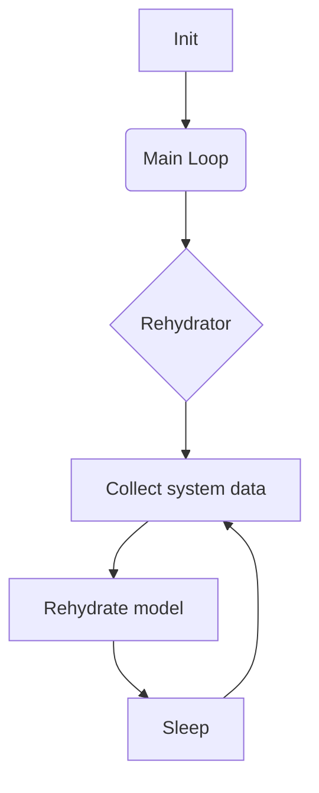
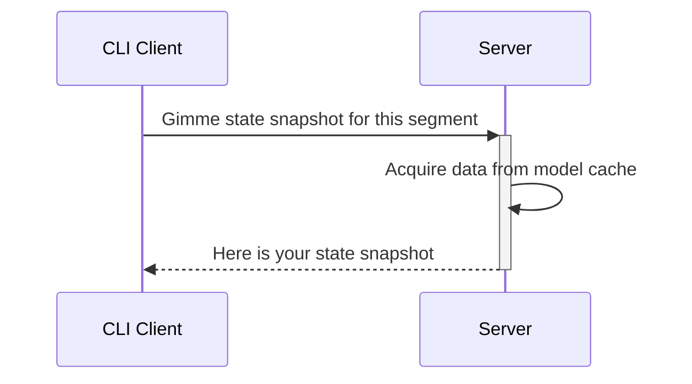

# Rusty Belt


# What is it
Client-server implementation of tmux statuses

# Features
 - Support of powerline like theme with separator
 - Support of BG and FG color pallets with round robin. 
 - CPU, Mem, Swap, Disk infortmation
 - Run shell commands with current PWD and without
 - Find and show connectes networks. (may be usefull for enumerating connected VPNs)
 - Show tmux session

# WIP features
 - Docs
 - Mac os brew build and instructions
 - Show current media status (artist/track/play/pause)
 - Weather info
 - Battery status

# Why
I hate to write shell scripts

# Why it  may be better than other statuses
Server caches all state and client fetches only status snapshot. So client can ask a server 1000 times per sec and it will not affect render time.

# How to install
<details>
  <summary>Install on GNU/Linux with cargo</summary>

```bash
cargo install rusty-belt
cd ~/.config/systemd/user/

touch rusty-belt.service # see example in resources/rusty-belt.service
systemctl daemon-reload --user
systemctl --user restart rusty-belt.service

mkdir ~/.config/rusty-belt
cd ~/.config/rusty-belt

touch config.yaml # see example in examples/config.yaml
touch log4rs.yaml # see example in examples/config.yaml

# check that server works
systemctl --user status rusty-belt.service


```

Use statuses in your tmux config
```
set -g status-right "#(tmux_client --segment-name=right)"
set -g status-left "#(tmux_client --segment-name=left)"
```


</details>

# My daily driver config

Colors based on awesome [catppuccin](https://github.com/catppuccin) theme

<details>
   <summary>config.yaml</summary>
 
```yaml
 ---
server:
  update_interval: 1
segments:
  - name: left
    bg_palet:
      - f5e0dc
      - f5c2e7
      - cba6f7
      - eba0ac
      - f9e2af
      - a6e3a1
      - 94e2d5
      - 89dceb
      - 89b4fa
      - b4befe
    fg_palet:
      - 11111b
      - 181825
      - 1e1e2e
    separator: 
    direction: ltr
    parts:
      - type: session_name
        template: " {{v}}"
      - type: vpn
        template: "{{#if v}}󰖂 {{#each v}}{{this}}{{#unless @last}}, {{/unless}}{{/each}}{{else}}No VPNs{{/if}}"
        names:
          - substring_matcher: "10.154.1."
            name: "prod"
          - substring_matcher: "10.154.154."
            name: "dev"
      - type: mem
        template: " {{v.used_percents}}% {{v.used_percents_graph}}"
      - type: cpu
        template: " {{v.consumption}}% {{v.consumption_graph}}"
  - name: right
    bg_palet:
      - f5e0dc
      - f5c2e7
      - cba6f7
      - eba0ac
      - f9e2af
      - a6e3a1
      - 94e2d5
      - 89dceb
      - 89b4fa
      - b4befe
    fg_palet:
      - 11111b
      - 181825
      - 1e1e2e
    separator: 
    direction: rtl
    parts:
      - type: disk
        dev: /dev/mapper/luks-7a504a5c-d5f0-4175-95b6-3a97c15a21ce
        template: "  {{v.mount_point}} {{v.available_space}}"
      - type: shell
        use_pwd: true
        cmd: gitmux -cfg ~/.config/tmux/gitmux.yaml
        template: "{{v.stdout}}"

```

</details>

# Screenshots


# Architecture diagram



