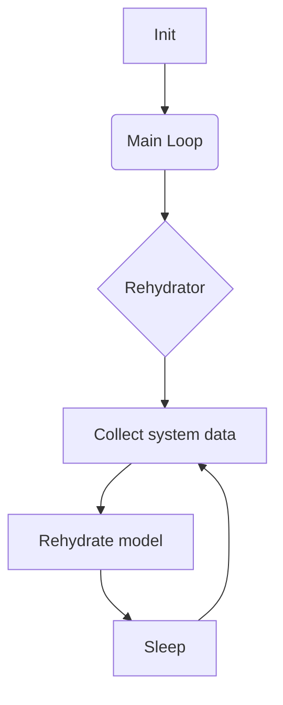
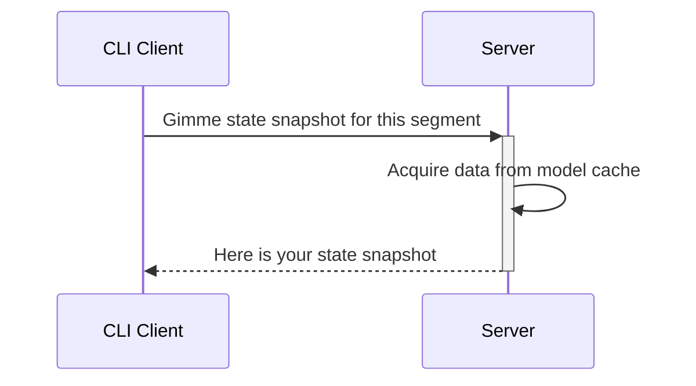

# What is it
Client-server implementation of tmux statuses

# Why
I hate to write shell scripts

# Why it  may be better than other statuses
Server caches all state and client fetches only status snapshot. So client can ask a server 1000 times per sec and it will not affect render time.

# How to install
~~Right now just cargo~~

# How to configure
Copy `example/config.yaml` to `~/.config/rusty-belt/`

Copy `example/log4rs.yaml` to `~/.config/rusty-belt/`

# Architecture diagram

