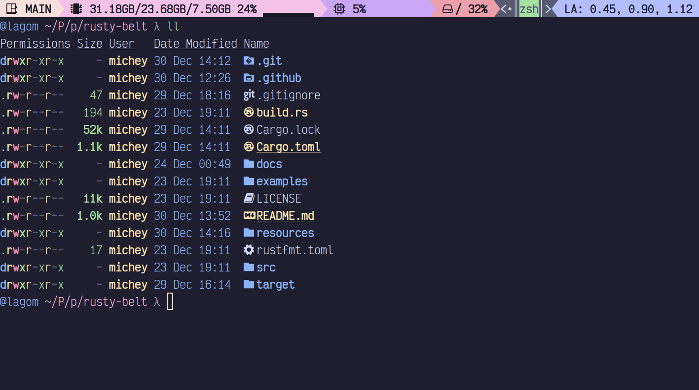

# Rusty Belt

Yet another one powerline for tmux.

## Y tho?

I decide to write this one because I really hate to edit bash scripts from previous ones.

## What is the difference

This one have client and server parts. Server collects information about system, client renders this information. 

## Features
 - Support of powerline like theme with separator
 - Support of BG and FG color pallets with round robin. 
 - CPU, Mem, Swap, Disk infortmation
 - Run shell commands with current PWD and without
 - Find and show connectes networks. (may be usefull for enumerating connected VPNs)
 - Show tmux session
 

