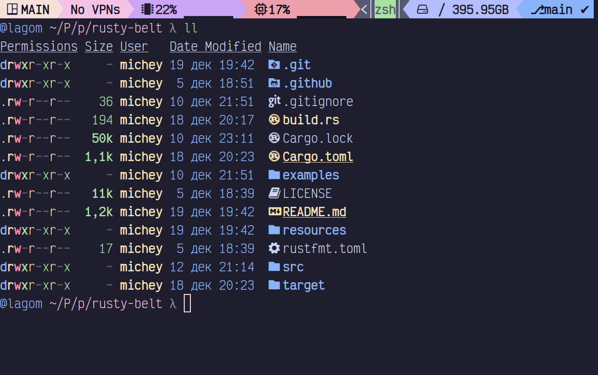

# My daily config of rusty-belt

### Requirements
 - gitmux


### Config

```yaml title="~/.config/rusty-belt/config.yaml"
---
server:
  update_interval: 1
segments:
  - name: left
    bg_palette:
      - "#f5e0dc"
      - "#f5c2e7"
      - "#cba6f7"
      - "#eba0ac"
      - "#f9e2af"
      - "#a6e3a1"
      - "#94e2d5"
      - "#89dceb"
      - "#89b4fa"
      - "#b4befe"
    fg_palette:
      - "#11111b"
      - "#181825"
      - "#1e1e2e"
    separator: 
    direction: ltr
    parts:
      - type: session_name
        template: " {{v}}"
      - type: vpn
        template: "{{#if v}}󰖂 {{#each v}}{{this}}{{#unless @last}}, {{/unless}}{{/each}}{{else}}No VPNs{{/if}}"
        names:
          - substring_matcher: "10.154.1."
            name: "prod"
          - substring_matcher: "10.154.154."
            name: "dev"
      - type: mem
        template: " {{v.used_percents}}% {{v.used_percents_graph}}"
      - type: cpu
        template: " {{v.consumption}}% {{v.consumption_graph}}"
  - name: right
    bg_palette:
      - "#f5e0dc"
      - "#f5c2e7"
      - "#cba6f7"
      - "#eba0ac"
      - "#f9e2af"
      - "#a6e3a1"
      - "#94e2d5"
      - "#89dceb"
      - "#89b4fa"
      - "#b4befe"
    fg_palette:
      - "#11111b"
      - "#181825"
      - "#1e1e2e"
    separator: 
    direction: rtl
    parts:
      - type: disk
        dev: /dev/mapper/luks-7a504a5c-****-****-****-3a97c15a21ce
        template: "  {{v.mount_point}} {{v.available_space}}"
      - type: shell
        use_pwd: true
        cmd: gitmux -cfg ~/.config/tmux/gitmux.yaml
        template: "{{v.stdout}}"
```


### Screenshots



